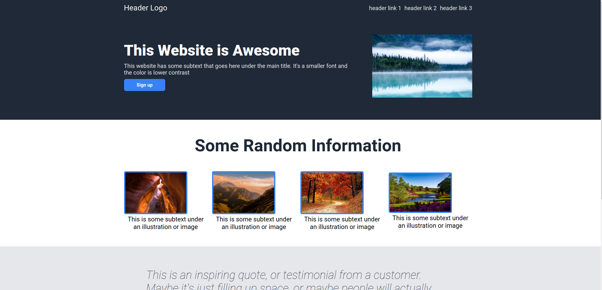

# Odin Project - Landing Page Project

This is a website project about a landing page by The Odin Project (https://www.theodinproject.com)

## Site Link
To view the website click on this link for a live preview

(https://atkthedeveloper.github.io/landing-page/)

## Credits
Creditations for all the images I used 
* Photo by <a href="https://unsplash.com/@kalenemsley?utm_content=creditCopyText&utm_medium=referral&utm_source=unsplash">Kalen Emsley</a> on <a href="https://unsplash.com/photos/body-of-water-surrounding-with-trees-_LuLiJc1cdo?utm_content=creditCopyText&utm_medium=referral&utm_source=unsplash">Unsplash</a>

* Photo by <a href="https://unsplash.com/@draufsicht?utm_content=creditCopyText&utm_medium=referral&utm_source=unsplash">Andreas Gücklhorn</a> on <a href="https://unsplash.com/photos/birds-eye-view-photography-of-trees-and-body-of-water-mawU2PoJWfU?utm_content=creditCopyText&utm_medium=referral&utm_source=unsplash">Unsplash</a>

* Photo by <a href="https://unsplash.com/@hikersbay?utm_content=creditCopyText&utm_medium=referral&utm_source=unsplash">Hikersbay Hikersbay</a> on <a href="https://unsplash.com/photos/grand-canyon-arizona-YG_Fxyqz9xg?utm_content=creditCopyText&utm_medium=referral&utm_source=unsplash">Unsplash</a>

* Photo by <a href="https://unsplash.com/@cristina_gottardi?utm_content=creditCopyText&utm_medium=referral&utm_source=unsplash">Cristina Gottardi</a> on <a href="https://unsplash.com/photos/mountains-at-golden-hour-wndpWTiDuT0?utm_content=creditCopyText&utm_medium=referral&utm_source=unsplash">Unsplash</a>

* Photo by Pixabay: https://www.pexels.com/photo/green-leafed-tree-beside-body-of-water-during-daytime-158063/

* Image by <a href="https://pixabay.com/users/valiphotos-1720744/?utm_source=link-attribution&utm_medium=referral&utm_campaign=image&utm_content=1072821">Valentin</a> from <a href="https://pixabay.com//?utm_source=link-attribution&utm_medium=referral&utm_campaign=image&utm_content=1072821">Pixabay</a>
